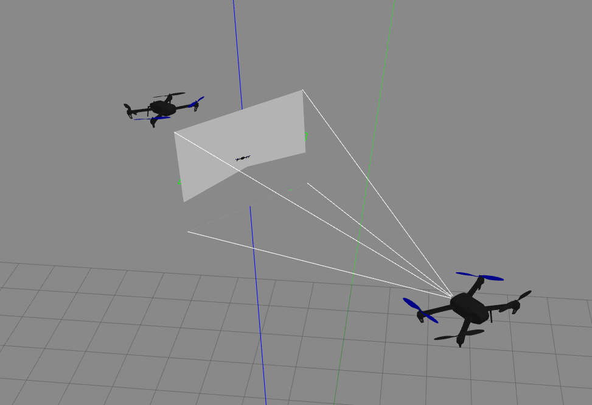
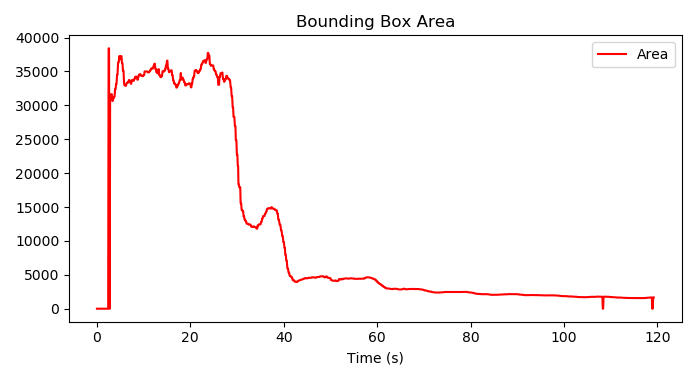
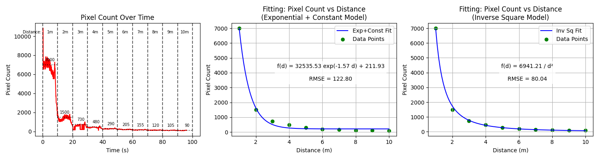
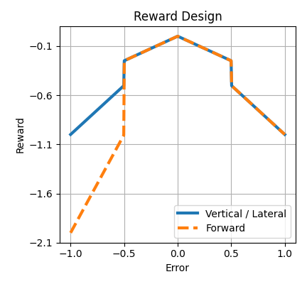
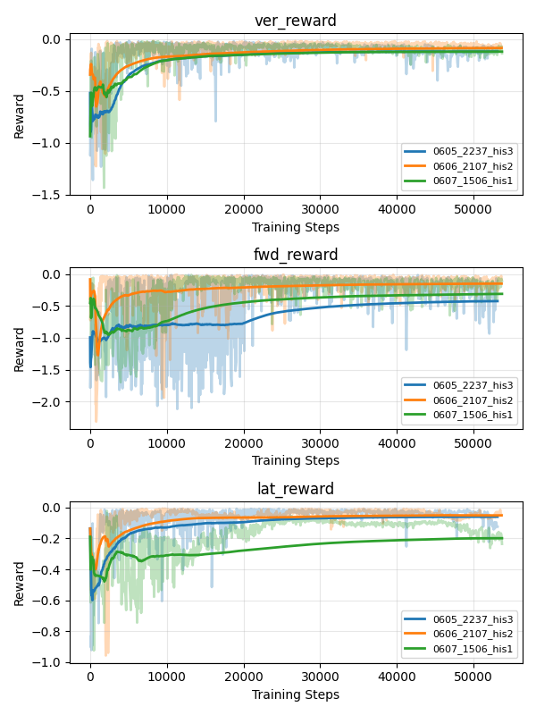
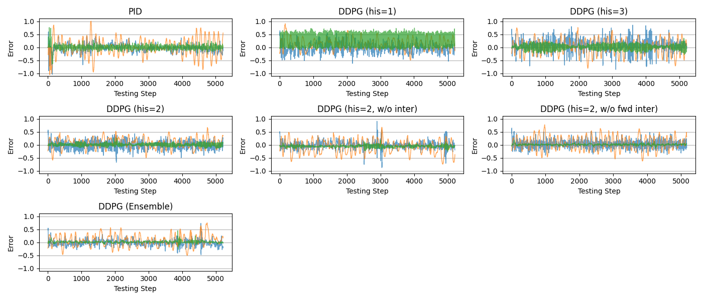
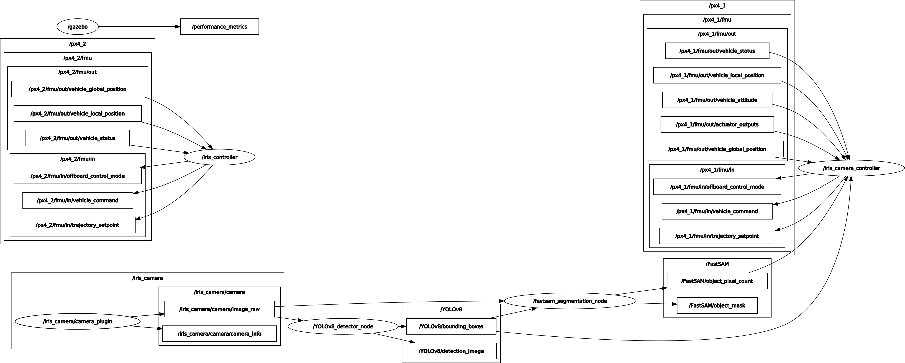

# 🛸 Iris Tracker: PID vs Deep RL (DDPG) Comparison



This project implements and compares real-time quadrotor tracking using a **monocular camera (RGB-only)**. It evaluates the performance of two different control strategies: **Classical PID Control** and **Deep Reinforcement Learning (DDPG)**.

---

## 🌟 Key Features

- **RGB-only Tracking**: Tracks the target without depth sensors, relying solely on monocular camera image data for distance estimation.
- **AI-based Detection**: Utilizes **YOLOv8** and **FastSAM** for robust target detection within the simulation environment.
- **Controller Comparison**: 
  - **PID**: Stable tracking implementation based on classical control theory.
  - **DDPG (Deep Deterministic Policy Gradient)**: Learns optimal control policies through reinforcement learning, handling non-linearities effectively.
  - **Decoupled DDPG**: Improves training efficiency by using independent DDPG agents for Vertical, Forward, and Lateral control.
- **Gazebo & PX4 Integration**: Validated in a high-fidelity physics environment mirroring real-world hardware.

---

## 🛠 System Architecture

### 1. Target Detection & Distance Estimation
To overcome the limitations of monocular vision, the distance is estimated by fitting the correlation between the **Bounding Box Area** or **Pixel Count** and the actual ground-truth distance.

| YOLOv8 BBox-based Distance Estimation | FastSAM Pixel-based Distance Estimation |
|:---:|:---:|
|  |  |

### 2. Control Logic (PID vs RL)
- **State**: Error in target center (Lateral, Vertical) and estimated distance error (Forward).
- **Action**: Velocity Setpoints or Position Setpoints (North, East, Down, Yaw) for the quadrotor.

#### Reward Function Design
The RL agent is trained using a carefully designed reward function that penalizes tracking errors. The reward decreases as the error increases, with a steeper penalty for longitudinal (Forward) distance errors to ensure safety and stability.




---

## 📂 Project Structure

```text
.
├── src/
│   ├── controller/      # ROS2 nodes for PID and RL controllers
│   ├── RL/              # DDPG algorithm implementation and training scripts
│   ├── utils/           # YOLOv8 and FastSAM wrapper classes
│   └── px4_msgs/        # Message definitions for PX4 communication
├── weights/             # Trained model weights (.pt, .pth)
├── results/             # Training logs and performance comparison results
└── pic/                 # Simulation screenshots and visualization data
```

---

## 📊 Experimental Results

### Training Progress
The decoupled DDPG agents (Vertical, Forward, Lateral) show stable convergence over training steps. The history length of the state vector significantly impacts the learning stability and final performance.



### Performance Comparison
We compared the tracking error of the classical PID controller against various DDPG configurations. The results show that DDPG agents, especially those with an optimized history length and ensemble approaches, achieve lower and more stable tracking errors compared to the traditional PID method.



### ROS Graph
The communication structure between nodes is as follows:


---

## 🚀 Getting Started

### Prerequisites
- Ubuntu 22.04
- ROS2 Humble
- PX4 Autopilot (v1.13+)
- Python 3.10+ (PyTorch, Ultralytics, OpenCV)

### How to Run
1. **Launch PX4 Simulation**:
   ```bash
   # In the PX4-Autopilot directory
   make px4_sitl gazebo-classic_iris__camera
   ```
2. **Run Detection Node**:
   ```bash
   ros2 run utils YOLOv8_node
   ```
3. **Run PID Controller**:
   ```bash
   ros2 run controller iris_camera_controller_PID --ros-args -p mode:=bbox
   ```
4. **Run RL Controller**:
   ```bash
   ros2 run controller iris_camera_controller_RL --ros-args -p mode:=bbox
   ```

---

## 📝 Research Summary
This project demonstrates that precise tracking is achievable using only a monocular camera. Specifically, the **Area-Distance Mapping** technique enables longitudinal (Forward) control without explicit depth data. While PID tuning is intuitive, it can be sensitive to disturbances. In contrast, the DDPG-based approach shows robust performance even against targets performing complex maneuvers through learned behavioral policies.